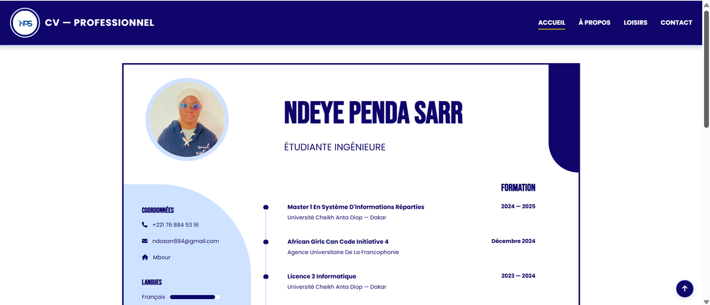
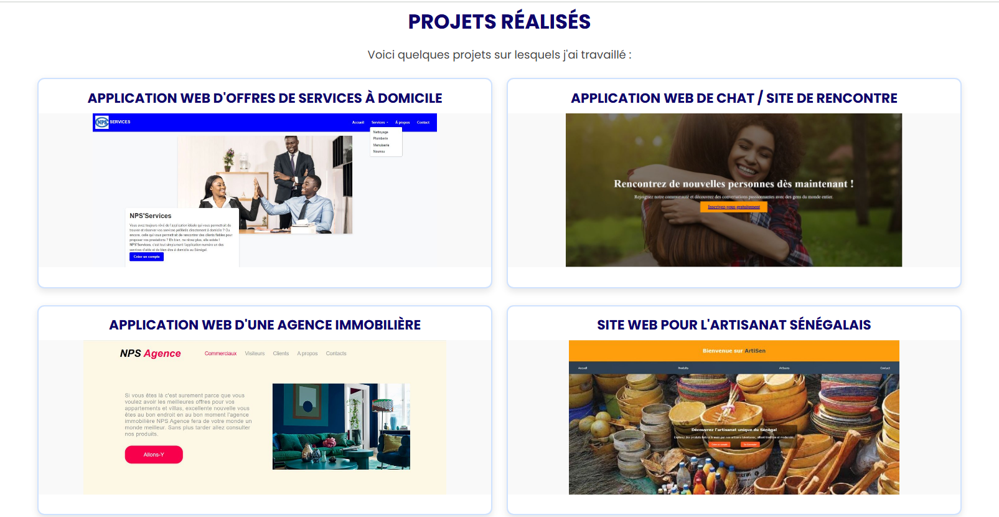
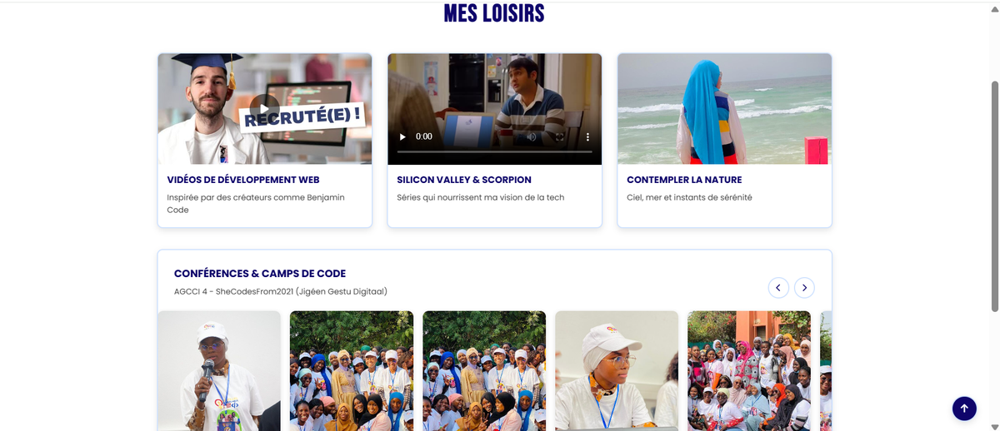
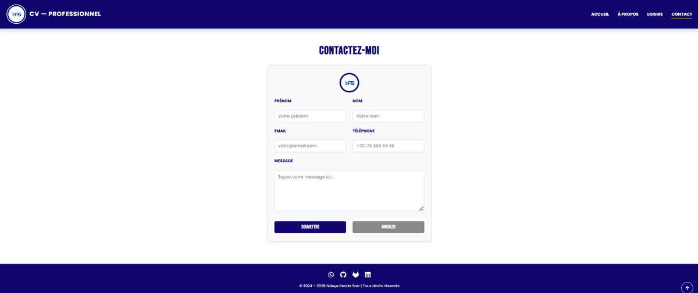
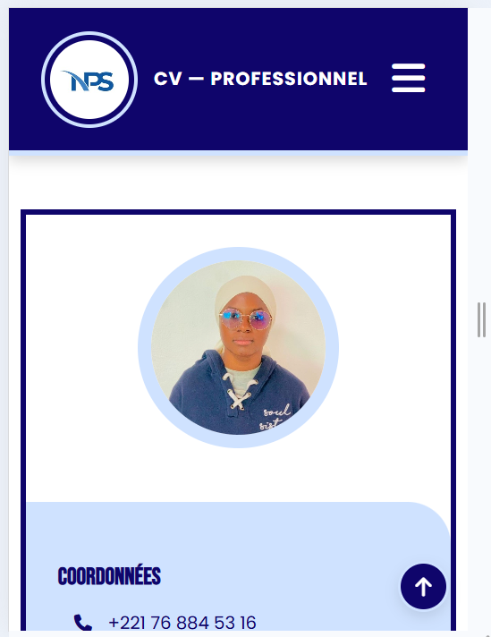
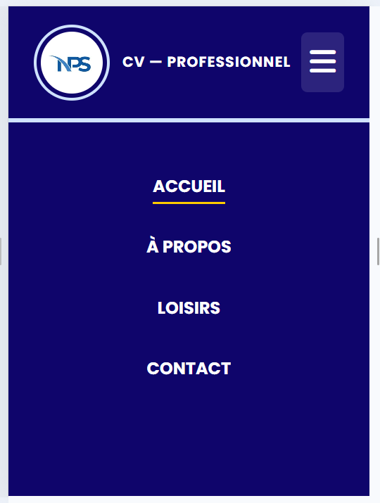

# 💼 Online CV — Ndeye Penda Sarr

> **Challenge personnel réalisé en 2024 :** reproduire fidèlement mon CV conçu sur Canva en HTML et CSS purs, sans framework ni bibliothèque, puis transformer cette reproduction en un véritable site web multi-pages.

🔗 **Démo en ligne :** https://ndeyependasarr.github.io/online-cv/

---

## 📸 Aperçu

| Accueil (desktop) | Projets | Loisirs |
|---|---|---|
|  |  |  |

| Contact | Accueil (mobile) | Menu mobile |
|---|---|---|
|  |  |  |

---

## 🎯 Contexte du projet

En 2024, j'ai conçu mon CV sur **Canva**. En le regardant, je me suis lancé un défi :

> *Serais-je capable de reproduire fidèlement ce design en HTML et CSS ?*

Après avoir réalisé la première version, j'ai décidé d'aller plus loin en transformant le CV en un **site web multi-pages complet**, avec notamment :

- une page d'accueil présentant le CV ;
- une page « À propos » ;
- une présentation de projets et d'expériences ;
- une galerie de participations à des événements tech ;
- une page consacrée aux loisirs ;
- un formulaire de contact ;
- une navigation responsive ;
- une page 404 personnalisée.

L'objectif était de mettre en pratique les fondamentaux du développement web **sans dépendre d'un framework CSS ou JavaScript**.

### 📌 À propos du contenu du CV

Le contenu présenté sur le site correspond volontairement à **la version de mon CV datant de 2024**, qui était la version utilisée pour réaliser le challenge initial.

Il ne s'agit donc pas de mon CV professionnel actuel.

Cette version historique a été conservée afin de préserver l'intégrité du projet et de distinguer clairement **le contenu du CV utilisé pour le challenge** du code et des techniques de développement démontrés dans ce dépôt.

---

## 🛠️ Stack technique

- **HTML5 sémantique** — `header`, `nav`, `main`, `section`, `footer`, attributs ARIA
- **CSS3 pur** — variables CSS (`:root`), Flexbox, Grid, `clamp()`, media queries et pseudo-éléments
- **JavaScript Vanilla** — interactions ciblées : menu mobile et carrousel
- **Formspree** — traitement du formulaire de contact sans backend
- **GitHub Pages** — hébergement et déploiement

Aucun framework ni bibliothèque front-end n'est utilisé.

---

## ✨ Points techniques notables

### 📐 Mise en page et responsive design

- Timeline CSS construite avec des pseudo-éléments positionnés relativement à chaque entrée.
- Utilisation combinée de **Flexbox** et **CSS Grid**.
- Quatre points de rupture pour adapter l'interface du mobile 360px aux grands écrans.
- Utilisation de `clamp()` pour certaines dimensions responsives.

### 🍔 Navigation

- Menu burger réalisé en **CSS pur** à l'aide du mécanisme de checkbox.
- Gestion de certaines interactions complémentaires en JavaScript.

### 🖼️ Carrousel

- Carrousel horizontal basé sur `scroll-snap`.
- Navigation par flèches.
- Défilement tactile natif sur mobile.

### ♿ Accessibilité

- Lien d'évitement (*skip link*).
- États `:focus-visible`.
- Attributs `aria-label`.
- Textes alternatifs descriptifs pour les images.
- Prise en compte de `prefers-reduced-motion`.

### ⚡ Performance

- Images optimisées et compressées.
- `loading="lazy"` pour les ressources adaptées.
- Dimensions `width` / `height` déclarées afin de limiter les décalages de mise en page (*layout shift*).
- `preconnect` pour les ressources externes nécessaires.

### 🔗 Partage et référencement

- Balises Open Graph.
- Twitter Card.
- URLs absolues pour les métadonnées de partage social.

---

## 📂 Structure du projet

online-cv/
├── index.html                
├── propos.html              
├── loisir.html               
├── contact.html             
├── 404.html                  
│
├── css/
│   └── style.css              
│
├── js/
│   └── main.js                
│
├── images/                   
├── screenshots/              
├── NPS-Cv-Pro.pdf            
└── LICENSE

🚀 Lancer le projet en local

Le projet ne nécessite aucune installation de dépendances ni étape de build.

1. Cloner le dépôt
git clone https://github.com/NdeyePendaSarr/online-cv.git
cd online-cv
2. Lancer un serveur local

Avec Python :

python -m http.server 8000

Puis ouvrir :

http://localhost:8000

Il est également possible d'ouvrir directement index.html dans un navigateur.

🎓 Compétences mises en pratique

Ce projet m'a permis de consolider plusieurs fondamentaux du développement web :

structuration sémantique d'une page HTML ;
conception d'interfaces responsive ;
CSS moderne sans framework ;
manipulation du DOM avec JavaScript ;
accessibilité web ;
optimisation des ressources ;
conception d'une navigation multi-pages ;
intégration d'un formulaire externe ;
utilisation de Git et GitHub ;
déploiement d'un site statique avec GitHub Pages.
📄 Licence

Ce projet est distribué sous licence MIT — voir le fichier LICENSE.

Le code est librement réutilisable conformément à la licence. Les contenus personnels présents dans le projet (CV, textes, photographies et autres éléments personnels) restent ma propriété.

👩🏾‍💻 Autrice

Ndeye Penda Sarr
Développeuse Web Full-Stack · Business Intelligence & Data
Dakar 🇸🇳

GitHub : @NdeyePendaSarr
GitLab : @NPS_Geek
LinkedIn : https://www.linkedin.com/in/ndeye-penda-sarr-493150318/

© 2024–2026 Ndeye Penda Sarr